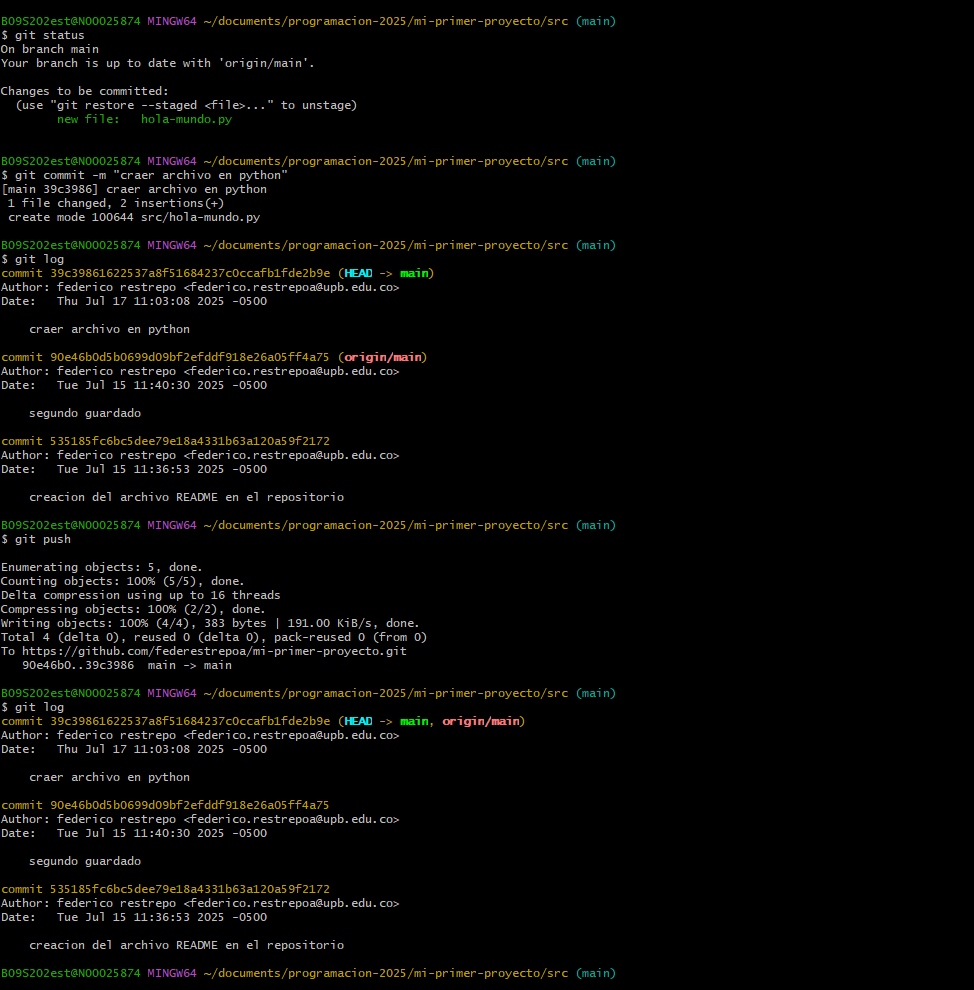

#  resumen de sincornizacion git hub
los pasos para crear un repo nuevo nuevo y enlazarlo con el locar:
ingresar a github 
crear el nuevo repo 
enlazarlo con la consola introduciendo el siguiente comando:
git remote add origin https://github.com/tu-usuario/mi-primer-proyecto.git
luego iniciar sesion en google
por ultimo para subir tus arcivhos introduces git push -u origin main
y para que las dos lineas esten sicronisadas debes poner git push 

